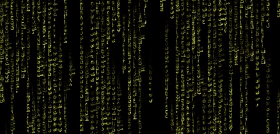

<<<<<<< HEAD
# Arabic Matrix Rain
A simple simulation of the Digital Rain sequence from [The Matrix](http://www.imdb.com/title/tt0133093/) using arabic symbols.

This is based on Xie's [Green rain](https://github.com/emilyxxie/green_rain). special thanks to her.

I used the yellow color to give the taste of visuals found in [The Blue Elephant](http://www.imdb.com/title/tt3461252/).
=======
# Arabic Digital Rain
A simple simulation of the Digital Rain sequence from the Matrix using arabic characters.

This is based on Xie's [Green rain](https://github.com/emilyxxie/green_rain).

I used the yellow color to give the taste of the visuals found in [The Blue Elephant](http://www.imdb.com/title/tt3461252/).
>>>>>>> ae61f8e29271da88d7b3f62bef1aa3ed01d0d487

[P5](https://p5js.org/) inside.
